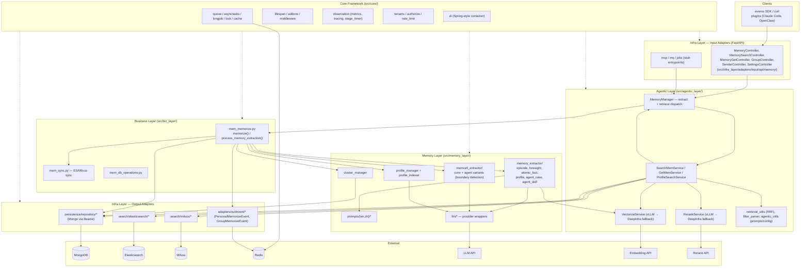
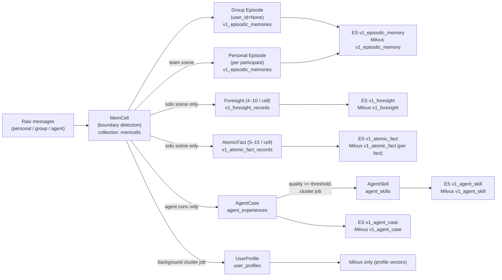
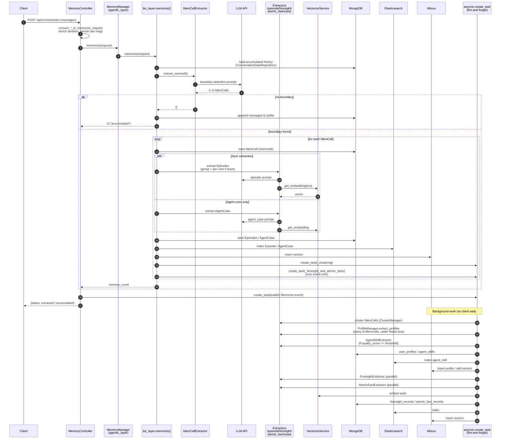
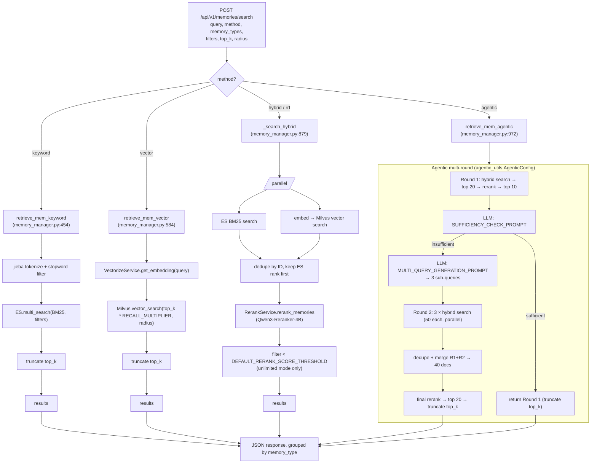
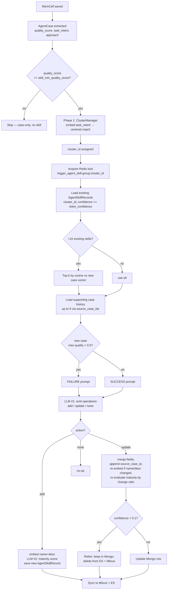

# EverOS — Study Notes

Personal reference notes from reading the repo's docs, the README files at every level, and the bundled PDF article. Written so a future session can pick up cold without re-reading every file.

## What this repo is

**EverOS** is an open-source long-term-memory operating system for AI agents, published by EverMind-AI under Apache 2.0. The repository is a monorepo organized around four parts:

| Part | Path | Purpose |
| :--- | :--- | :--- |
| Methods | [methods/](methods/) | Runnable memory architectures — **EverCore** (the main system) and **HyperMem** (hypergraph variant) |
| Benchmarks | [benchmarks/](benchmarks/) | **EverMemBench** (memory quality) and **EvoAgentBench** (agent self-evolution) |
| Use cases | [use-cases/](use-cases/) | Demos and integrations: Claude Code plugin, Game of Thrones Q&A, OpenHer, plus links to ~13 external use cases |
| Evaluation | [methods/EverCore/evaluation/](methods/EverCore/evaluation/) | Runner that reproduces results on LoCoMo / LongMemEval / PersonaMem |

The pitch is that EverCore is the **production-grade** implementation behind the ideas in the bundled PDF — extracting, structuring, and retrieving memory from agent conversations so the agent can "remember, understand, and continuously evolve."

## The bundled PDF: how-ai-agent-remember.PDF

`how-ai-agent-remember.PDF` is an image-only document (one logical page, 213×9767 pixels, 46 stacked JPEG tiles). It is a long-form Chinese tech article by 铁锤人 (`@lxfater`) dated May 12, titled **"AI Agent 是如何记住东西的？从原理到实战详细解释"** ("How does an AI Agent remember things? From principles to practice"). It is captured as a Twitter/X scrollshot, so it cannot be re-read with `pdftotext`-style tools — must extract images. Key beats:

1. **Why LLM APIs are stateless.** Each API call has no memory of prior ones — the only memory is what is stuffed into the prompt as chat history. Once history exceeds the context window, it gets compressed.
2. **Single-session vs. cross-session memory.** Chat history + compression handles a single session; a long-term memory system is needed across sessions ("会话会清空, 记忆库不会").
3. **Three memory types** (cited from a Nov 2025 Google paper *Context Engineering, Sessions and Memory*):
   - **Episodic** (情景记忆) — what happened
   - **Semantic** (语义记忆) — who you are, what you like
   - **Procedural** (程序性记忆) — how to do things
4. **OpenClaw's simple memory** = three Markdown files: `memory.md` (semantic), daily logs (episodic, append-only), session snapshots (last 15 meaningful messages of a session). Limits: token cost, markdown is lossy, often forgets.
5. **Enterprise-grade = EverOS.** EverOS refines the 3 categories into **6 sub-types**:
   - Semantic: *Stable Trait* (稳定特质) + *Transient State* (临时状态)
   - Episodic: *Episode* (剧情记忆), *EventLog* (事件日志), *Foresight* (未来记)
   - Procedural: *Agent Case* (任务档案) + *Agent Skill* (蒸馏技能)
6. **Two questions to understand any memory system** (the article's framing):
   - How are memories classified, and what does each store?
   - How are memories extracted, updated, and retrieved?
7. **EverOS retrieval has 4 modes**: keyword, vector, hybrid (keyword + vector + rerank — default), **Agentic** (LLM-driven multi-round active reconstruction).
8. **Numbers cited**: LoCoMo **93.05%** with GPT-4.1-mini (vs Zep 85.22%). The README also lists LongMemEval **83.00%** and HyperMem **92.73%** on LoCoMo.
9. **Free Cloud API** at `everos.evermind.ai` — 50K credits/month, `pip install everos`. Three official plugins: Claude Code Plugin, OpenClaw Plugin, OpenClaw Skill.

The PDF is essentially marketing/educational copy that explains the project's mental model. It is **not** technical documentation — but the 6 memory-type taxonomy and the "extract → update → retrieve" framing are the lens the rest of the codebase uses.

## Project map and key entry points

From [AGENTS.md](AGENTS.md):

- **EverCore application entry**: [methods/EverCore/src/run.py](methods/EverCore/src/run.py)
- **Core memory manager**: [methods/EverCore/src/agentic_layer/memory_manager.py](methods/EverCore/src/agentic_layer/memory_manager.py)
- **REST API controllers**: [methods/EverCore/src/infra_layer/adapters/input/api/](methods/EverCore/src/infra_layer/adapters/input/api/)
- **Docs**: [methods/EverCore/docs/](methods/EverCore/docs/)
- **Prompts (EN/ZH)**: `methods/EverCore/src/memory_layer/prompts/`
- **Evaluation runner**: [methods/EverCore/evaluation/](methods/EverCore/evaluation/)

Development conventions:
- All I/O is async (`await`).
- EverCore is **multi-tenant** — data must remain tenant-scoped.
- Prompts have EN/ZH variants.

## EverCore architecture

From [methods/EverCore/docs/ARCHITECTURE.md](methods/EverCore/docs/ARCHITECTURE.md) and [OVERVIEW.md](methods/EverCore/docs/OVERVIEW.md):

- **6-layer architecture**: Agentic, Memory, Retrieval, Business, Infrastructure, Core Framework.
- **Atomic unit**: **MemCell**.
- **7 memory types** (slightly different framing from the PDF's 6): episodes, profiles, preferences, relationships, semantic knowledge, basic facts, core memories.
- **Two retrieval modes**:
  - *Lightweight*: BM25 + vector + RRF rerank.
  - *Agentic*: multi-round, LLM expands queries and decides when to stop.
- **Storage stack**: MongoDB, Elasticsearch, Milvus, Redis.
- **Tech**: FastAPI, Python 3.10+, `uv` package manager.
- **Two-track pipeline**:
  - *Construction*: MemCell extraction → multi-level memory → indexing.
  - *Perception*: hybrid retrieval + reranking + reasoning fusion.

The server runs at `http://localhost:1995`. Health check: `curl http://localhost:1995/health`. Base API path: `/api/v1`. Primary endpoints used in examples: `POST /memories` (store) and `GET /memories/search` (retrieve, with `retrieve_method: hybrid`).

## HyperMem

[methods/HyperMem/](methods/HyperMem/) — alternate architecture, ACL 2026 paper implementation. 3-level hypergraph (topics → episodes → facts) connected via weighted hyperedges. Coarse-to-fine retrieval: RRF-fused BM25+dense at topic level, then narrow to episode/fact. LoCoMo 92.73% LLM-judge (beats HyperGraphRAG 86.49% and MemOS 75.80%). Python 3.12, Qwen3 embedding/reranker, OpenRouter LLM.

## Benchmarks

- **[EverMemBench](benchmarks/EverMemBench/)** — multi-person group chat memory quality eval. Supports Memos, Mem0, Memobase, EverCore, Zep, plus an LLM long-context baseline. Pipeline: Add → Search → Answer → Evaluate. MCQ and open-ended question types. LLM judging via Gemini-3-Flash. Dataset: 5 user batches (004, 005, 010, 011, 016).
- **[EvoAgentBench](benchmarks/EvoAgentBench/)** — agent self-evolution across 5 domains: Information Retrieval (BrowseCompPlus 154/65), Reasoning (OmniMath 478/100), Software Engineering (SWE-Bench 101/26), Code Implementation (LiveCodeBench 97/39), Knowledge Work (GDPVal 87/58). Agent backends: nanobot (Python), openclaw (Node.js). Two self-evolution modes: offline batch extract-then-evaluate; online real-time learning. Comparison includes EverCore, EvoSkill, Memento, OpenSpace, ReasoningBank.

## Use cases (in-repo)

- [use-cases/claude-code-plugin/](use-cases/claude-code-plugin/) — Claude Code plugin with hooks (SessionStart, UserPromptSubmit, Stop, SessionEnd). Local JSONL storage + EverMem Cloud API. Memory Hub dashboard with heatmap.
- [use-cases/openher/](use-cases/openher/) — OpenHer companion. Emergent personality via neural drives + Hebbian learning, paired with EverCore memory. Async two-stage retrieval (search fires after each turn, results used next turn to avoid stalling >500ms). 25D→24D→8D neural net. SQLite FTS5 local + EverCore cloud.
- [use-cases/game-of-throne-demo/](use-cases/game-of-throne-demo/) — side-by-side Q&A comparing with/without memory on *A Game of Thrones*. React 18 + Vite frontend, Node/Express/Bun backend, Claude Haiku via OpenRouter + EverMind Cloud.

Plus ~13 **external** use cases (links in [README.md](README.md)): Earth Online (productivity game), Golutra (multi-agent for engineering teams), taste-verse, Ruminer browser agent, EverMem Sync, MCO, StudyBuddy, MemoCare (iOS, Alzheimer's), NeuralConnect (iOS sci-fi), Mobi (iOS companion), Spiro (AI wearable), OpenClaw Agent Memory, Live2D character (TEN Framework), Computer-Use with Memory, Memory Graph Visualization.

## Quick commands

```bash
cd methods/EverCore
docker compose up -d          # Start infrastructure
uv sync                       # Install dependencies
cp env.template .env          # Configure LLM_API_KEY, VECTORIZE_API_KEY
uv run python src/run.py      # Run server at :1995
curl http://localhost:1995/health
make test
make lint
uv run pyright                # If installed
```

Evaluation:
```bash
cd methods/EverCore
uv sync --group evaluation
uv run python -m evaluation.cli --dataset locomo --system everos --smoke   # Quick check
uv run python -m evaluation.cli --dataset locomo --system everos           # Full run
cat evaluation/results/locomo-everos/report.txt
```

## Key claims and numbers to remember

| Metric | Number | System |
| :--- | :--- | :--- |
| LoCoMo (LLM-judge) | **93.05%** | EverCore (GPT-4.1-mini) |
| LongMemEval | **83.00%** | EverCore |
| LoCoMo | 92.73% | HyperMem |
| LoCoMo | 85.22% | Zep (baseline cited in PDF) |
| LoCoMo | 86.49% | HyperGraphRAG |
| LoCoMo | 75.80% | MemOS |

Papers cited in the README: arXiv 2601.02163 (EverMemOS), 2604.08256 (HyperMem), 2602.01313 (Multi-Party Collaborative Dialogues). Note: those arXiv IDs are dated 2026.

## Open-source DX conventions (from CLAUDE.md/AGENTS.md)

- Keep root uncluttered. Community files belong in `.github/` (`CONTRIBUTING.md`, `CODE_OF_CONDUCT.md`, `SECURITY.md`, issue templates, PR template).
- `CITATION.cff` is optional.
- Repo-relative links in the README; verify links resolve.
- `.github/workflows/docs.yml` stays lightweight and dependency-free.
- Treat broken links, stale setup commands, missing `.env.example`, unclear issue templates as DX bugs.

## What I would NOT find in the docs alone

These have to be read from source (not yet studied in this session):
- Exact `MemCell` schema and the 7 memory-type fields.
- How `agentic_layer/memory_manager.py` coordinates extraction → update → retrieval.
- REST controller routes beyond `/health`, `/memories`, `/memories/search`.
- The "Semantic Consolidation" / "Profile Evolution" update logic the PDF mentions.
- Prompts under `src/memory_layer/prompts/` (EN/ZH variants).

---

# Investigation Log

## Q1 (2026-05-17): Investigate source code in `methods/EverCore` and docs in `methods/EverCore/docs`. Come up with an architecture diagram and data flow charts.

### Method

Read all 24 docs under [methods/EverCore/docs/](methods/EverCore/docs/) plus [memory_types_guide.md](methods/EverCore/docs/dev_docs/memory_types_guide.md) and [RETRIEVAL_STRATEGIES.md](methods/EverCore/docs/advanced/RETRIEVAL_STRATEGIES.md), then traced concrete call paths through the source tree. Key files inspected directly: [memory_controller.py](methods/EverCore/src/infra_layer/adapters/input/api/memory/memory_controller.py), [memory_search_controller.py](methods/EverCore/src/infra_layer/adapters/input/api/memory/memory_search_controller.py), [memory_get_controller.py](methods/EverCore/src/infra_layer/adapters/input/api/memory/memory_get_controller.py), [biz_layer/mem_memorize.py](methods/EverCore/src/biz_layer/mem_memorize.py), [agentic_layer/memory_manager.py](methods/EverCore/src/agentic_layer/memory_manager.py), [agentic_layer/search_mem_service.py](methods/EverCore/src/agentic_layer/search_mem_service.py), [agentic_layer/rerank_service.py](methods/EverCore/src/agentic_layer/rerank_service.py), [agentic_layer/vectorize_service.py](methods/EverCore/src/agentic_layer/vectorize_service.py), [agentic_layer/agentic_utils.py](methods/EverCore/src/agentic_layer/agentic_utils.py), and the persistence/search adapters under [infra_layer/adapters/out/](methods/EverCore/src/infra_layer/adapters/out/). Detailed trace was delegated in parallel to two `Explore` subagents (memorize path + retrieve path) and the results cross-checked against the controller code.

### A. EverCore at a glance

EverCore is a FastAPI service that exposes a small REST surface (`/api/v1/memories/*`) and runs the **construction** (memorize) and **perception** (retrieve) pipelines defined in the docs. The framing in [docs/ARCHITECTURE.md](methods/EverCore/docs/ARCHITECTURE.md) is six layers, but the source has only five `*_layer/` directories — there is **no** standalone `retrieval_layer/`; retrieval lives inside `agentic_layer/` ([memory_manager.py](methods/EverCore/src/agentic_layer/memory_manager.py), [search_mem_service.py](methods/EverCore/src/agentic_layer/search_mem_service.py)). The DI / lifespan / middleware "Core Framework" is `src/core/`.

Storage and external dependencies (from `docker-compose.yaml` and the adapters):

| Component | Role | Where it shows up |
| :--- | :--- | :--- |
| **MongoDB** | Primary store for all memory documents | [persistence/repository/](methods/EverCore/src/infra_layer/adapters/out/persistence/repository/) |
| **Elasticsearch** | BM25 keyword index per memory type | [adapters/out/search/elasticsearch/](methods/EverCore/src/infra_layer/adapters/out/search/elasticsearch/) |
| **Milvus** | Vector index per memory type | [adapters/out/search/milvus/](methods/EverCore/src/infra_layer/adapters/out/search/milvus/) |
| **Redis** | Cache + distributed locks (clustering, agent skill) | `core/cache/`, `core/lock/` |
| **LLM API** (any OpenAI-compatible) | Boundary detection, episode/foresight/atomic-fact/case/skill extraction, agentic query expansion, sufficiency check | `memory_layer/llm/`, `memory_layer/prompts/{en,zh}/` |
| **Embedding API** | Vectorize episodes, foresight, atomic facts, cases, skills, and queries | [vectorize_service.py](methods/EverCore/src/agentic_layer/vectorize_service.py) (vLLM primary + DeepInfra fallback) |
| **Rerank API** | Score candidate hits in hybrid and agentic modes | [rerank_service.py](methods/EverCore/src/agentic_layer/rerank_service.py) — default `Qwen/Qwen3-Reranker-4B` |

### B. Layered architecture (Mermaid)



### C. Memory taxonomy and storage map

The source has **more** memory types than the docs' "episode / foresight / atomic-fact" three; agent conversations add `agent_case` + `agent_skill`, and the cluster pipeline maintains `user_profile`. All of them descend from **one MemCell** boundary unit.



Key constraint from [memory_types_guide.md](methods/EverCore/docs/dev_docs/memory_types_guide.md): each downstream memory has a `parent_type` + `parent_id` pointing back to **exactly one** MemCell. Foresight and AtomicFact are skipped in group chat for efficiency.

### D. Memorize (write) data flow

Entry: `POST /api/v1/memories` (personal), `POST /api/v1/memories/group`, `POST /api/v1/memories/agent`, plus three corresponding `*/flush` endpoints. All six handlers in [memory_controller.py](methods/EverCore/src/infra_layer/adapters/input/api/memory/memory_controller.py) converge on `await self.memory_manager.memorize(memorize_request)` which delegates to [biz_layer/mem_memorize.py:1676 `memorize()`](methods/EverCore/src/biz_layer/mem_memorize.py).



Highlights from the trace:

- **Sync path** blocks the client only for: history load → MemCell boundary detection (LLM) → Episode/AgentCase extraction (LLM + embed) → Mongo/ES/Milvus writes. Typical 2–10 s.
- **Async fire-and-forget** via `asyncio.create_task` (no external queue): clustering + profile update + agent-skill distillation, plus foresight + atomic-fact extraction. Coordinated by Redis distributed locks (`trigger_clustering:{group_id}`, `trigger_agent_skill:{group_id}:{cluster_id}`).
- **Group chat** skips Foresight and AtomicFact entirely; **agent conversations** with long tool-call assistant responses (≥ 1000 chars) skip AtomicFact.
- **Embeddings** are computed inside each extractor right after the LLM emits text — they are stored on the Mongo doc and copied into Milvus by the converters. There is no separate "indexer" pass.

### E. Retrieve (read) data flow

Entry: `POST /api/v1/memories/search` ([memory_search_controller.py](methods/EverCore/src/infra_layer/adapters/input/api/memory/memory_search_controller.py)) and `POST /api/v1/memories/get` ([memory_get_controller.py](methods/EverCore/src/infra_layer/adapters/input/api/memory/memory_get_controller.py)). `search` runs ranked retrieval; `get` is a plain paginated Mongo query.

The retrieval method (`method` field) chooses one of four code paths. Naming in code differs slightly from the docs: docs use `keyword | vector | rrf | agentic`; code accepts `KEYWORD | VECTOR | HYBRID | AGENTIC`. "Hybrid" is the same thing as "RRF" in the docs — parallel BM25 + Milvus, then deduplicate and rerank.



Notable details from [agentic_utils.py:84](methods/EverCore/src/agentic_layer/agentic_utils.py) (`AgenticConfig`): `round1_top_n=20`, `round1_rerank_top_n=10`, `num_queries=3`, `round2_per_query_top_n=50`, `combined_total=40`, `final_top_n=20`. Constants in [biz_layer/retrieve_constants.py](methods/EverCore/src/biz_layer/retrieve_constants.py): `DEFAULT_TOPK_LIMIT=100`, `DEFAULT_RECALL_MULTIPLIER=2`, `DEFAULT_MILVUS_SIMILARITY_THRESHOLD=0.6`, `DEFAULT_RERANK_SCORE_THRESHOLD=0.6`, `AGENT_MEMORY_MILVUS_RADIUS=0.1`.

Filters (`user_id`, `group_id`, `session_id`, time range, `memory_types`) are pushed **down** to the ES query and Milvus query — never applied post-fusion. Profiles use a separate `ProfileSearchService` path (Milvus-only, no rerank). Agent memories (`agent_case`, `agent_skill`) follow the same four-mode dispatch as regular memories but live in their own ES/Milvus collections.

### F. End-to-end cognitive loop

Pulling it together — the "construction → perception" loop from [OVERVIEW.md](methods/EverCore/docs/OVERVIEW.md) maps to the code as:

```
            ┌────────────────────── memorize (write) ───────────────────────┐
            │                                                                │
   raw msgs ─► boundary ─► MemCell ─► fan-out extraction ──► Mongo + ES + Milvus
   (HTTP)     detection             (episode, foresight,        (per type)
                                     atomic_fact, agent_case,
                                     agent_skill, profile)
            │                                                                │
            └─────────── async cluster + profile + skill jobs ───────────────┘

            ┌─────────────────────── retrieve (read) ───────────────────────┐
            │                                                                │
   query ─► method dispatch ─► [BM25 | vector | hybrid+rerank | agentic loop] ─► ranked memories
   (HTTP)                                                                       │
                                                                                ▼
                                          caller (agent / app / SDK) fuses into prompt
            └────────────────────────────────────────────────────────────────┘
```

### Gaps still worth investigating

- **Profile evolution logic** — `ProfileManager` only sketched here; the merge/diff rules between cluster runs are not yet read.
- **AgentSkill distillation** — quality scoring and when the same cluster gets re-skilled.
- **Prompt templates** — `memory_layer/prompts/{en,zh}/` not yet inventoried; would explain the exact shape of each extractor's LLM output.
- **`mq` / `jobs` / `mcp` input adapters** are stubs in the source — confirm whether they are placeholders or wired up via DI elsewhere.
- **Tenant scoping** — `core/tenants/` exists but how `user_id`/`group_id`/`space_id` map to tenant boundaries was not traced.

## Q2 (2026-05-17): What is an agent skill and what is an agent case (grounded in EverCore code)?

### Method

First answer attempted from generic Claude Code / use-cases-directory framing — that was wrong. Re-grounded in source by reading the two Beanie ODM documents that actually define the types:

- [methods/EverCore/src/infra_layer/adapters/out/persistence/document/memory/agent_case.py](methods/EverCore/src/infra_layer/adapters/out/persistence/document/memory/agent_case.py)
- [methods/EverCore/src/infra_layer/adapters/out/persistence/document/memory/agent_skill.py](methods/EverCore/src/infra_layer/adapters/out/persistence/document/memory/agent_skill.py)

Cross-referenced extractors at [agent_case_extractor.py](methods/EverCore/src/memory_layer/memory_extractor/agent_case_extractor.py) and [agent_skill_extractor.py](methods/EverCore/src/memory_layer/memory_extractor/agent_skill_extractor.py).

### A. AgentCase — a single compressed task experience

One agent conversation (a "MemCell") gets compressed into **at most one** `AgentCaseRecord`. It is the episodic record of *what happened this one time*. Key fields ([agent_case.py:37-48](methods/EverCore/src/infra_layer/adapters/out/persistence/document/memory/agent_case.py#L37-L48)):

- `task_intent` — rewritten task description used as a retrieval key
- `approach` — step-by-step path the agent actually took, with decisions and lessons
- `quality_score` — completion quality, 0.0–1.0
- `key_insight` — pivotal strategy shift or decision

Concrete example baked into the file ([agent_case.py:70-79](methods/EverCore/src/infra_layer/adapters/out/persistence/document/memory/agent_case.py#L70-L79)):

> **task_intent:** "Search for open source Python web frameworks and compare their GitHub stars"
> **approach:** "1. Searched GitHub for Python web frameworks with >5K stars… 2. Selected top 3: Django, Flask, FastAPI… 3. Compared stars and activity — FastAPI has fastest growth"
> **quality_score:** 0.85

A Case is "one war story, with a score." Collection: `v1_agent_cases`.

### B. AgentSkill — a reusable procedure distilled from many Cases

A Skill is derived by clustering semantically similar AgentCases into a **MemScene** (cluster) and extracting/merging a reusable recipe — see [agent_skill.py:21-29](methods/EverCore/src/infra_layer/adapters/out/persistence/document/memory/agent_skill.py#L21-L29). Key fields:

- `cluster_id` — the MemScene this skill generalizes from
- `name` / `description` — semantic handle for retrieval
- `content` — the actual reusable recipe
- `confidence` — rises as more supporting Cases land ([agent_skill.py:48-53](methods/EverCore/src/infra_layer/adapters/out/persistence/document/memory/agent_skill.py#L48-L53))
- `maturity_score` — retrieval gate; only skills ≥ threshold are returned ([agent_skill.py:56-61](methods/EverCore/src/infra_layer/adapters/out/persistence/document/memory/agent_skill.py#L56-L61))
- `source_case_ids` — back-references to the Cases that taught it ([agent_skill.py:72-75](methods/EverCore/src/infra_layer/adapters/out/persistence/document/memory/agent_skill.py#L72-L75))

Concrete example baked into the file ([agent_skill.py:82-89](methods/EverCore/src/infra_layer/adapters/out/persistence/document/memory/agent_skill.py#L82-L89)):

> **name:** "Technical comparison research"
> **description:** "Compare open source technical solutions or frameworks by searching, extracting, and evaluating key metrics"
> **content:** "1. search(tech + open source + github) 2. Extract repo list from results 3. Open README for each repo 4. Compare by stars, activity, and features"
> **confidence:** 0.85

That Skill is the generalized form of the Case above, plus many similar ones. Collection: `v1_agent_skills`.

### C. Lifecycle (Case → Cluster → Skill)

```
agent finishes a conversation (MemCell)
        │
        ▼
  agent_case_extractor  ──►  AgentCaseRecord   (one episode, scored)
        │
        ▼
  cluster_manager       ──►  MemScene cluster  (groups similar Cases)
        │
        ▼
  agent_skill_extractor ──►  AgentSkillRecord  (generalized procedure)
        │                    + confidence rises with each new supporting Case
        ▼
  retrieval at maturity_score ≥ threshold
```

This matches the section-D memorize flow: AgentCase extraction is on the sync path; cluster + AgentSkill distillation runs async under a Redis lock (`trigger_agent_skill:{group_id}:{cluster_id}`).

### D. One-line distinction

- **AgentCase** = episodic ("I did X once, here's how it went")
- **AgentSkill** = procedural ("Across many episodes like that, here's the reusable recipe")

Classic episodic→procedural memory consolidation, implemented as a clustering pipeline.

### Correction note

Earlier in the session I described "agent skill" using the Claude Code `/skill` system and "agent case" as a synonym for the [use-cases/](use-cases/) directory. That answer was wrong for this repository — in EverCore those terms refer to the two Mongo document types above, not to anything Claude-Code-specific.

## Q3 (2026-05-17): AgentCases generate AgentSkills — describe exactly how EverCore does it.

### Method

Traced the code paths end-to-end:

- Trigger: [biz_layer/mem_memorize.py:95-106, 333-370, 559-708](methods/EverCore/src/biz_layer/mem_memorize.py)
- Clustering: [memory_layer/cluster_manager/manager.py](methods/EverCore/src/memory_layer/cluster_manager/manager.py)
- Extractor: [memory_layer/memory_extractor/agent_skill_extractor.py](methods/EverCore/src/memory_layer/memory_extractor/agent_skill_extractor.py) (entry: `extract_and_save` at line 781)

The answer below: cases generate skills, but only via clustering, and the extraction is **incremental** (one new case merged into existing skills per call — not a batch re-derivation).

### A. Trigger conditions (sync path inside `memorize()`)

After a MemCell is saved and its AgentCase is extracted, [mem_memorize.py:351](methods/EverCore/src/biz_layer/mem_memorize.py#L351) gates skill extraction on three checks:

```python
if cluster_id and agent_case and _is_agent_case_quality_sufficient(agent_case, config):
```

- `cluster_id` — Phase 1 clustering must have assigned this MemCell to a MemScene.
- `agent_case` — only agent conversations qualify (no AgentCase ⇒ no skill work).
- Quality gate at [mem_memorize.py:95-106](methods/EverCore/src/biz_layer/mem_memorize.py#L95-L106): `agent_case.quality_score >= config.skill_min_quality_score`.

A Redis distributed lock `trigger_agent_skill:{group_id}:{cluster_id}` serializes concurrent writes for the same cluster ([mem_memorize.py:352-363](methods/EverCore/src/biz_layer/mem_memorize.py#L352-L363)). Different clusters in the same group can still run in parallel.

### B. Phase 1: clustering — which MemScene does this case belong to?

In `_trigger_clustering()`, the **`task_intent`** (not the raw episode) drives clustering for agent cases ([mem_memorize.py:177-181](methods/EverCore/src/biz_layer/mem_memorize.py#L177-L181)):

```python
clustering_text = (
    agent_case.task_intent if has_case and agent_case.task_intent
    else episode_text
)
```

`ClusterManager` embeds that text and compares to existing **cluster centroids** (running mean of member vectors) under `cluster_similarity_threshold`. Either the case joins the nearest existing `cluster_XXX` or a new one is minted ([manager.py:55-61](methods/EverCore/src/memory_layer/cluster_manager/manager.py#L55-L61)). Clusters containing agent cases are tracked in `MemSceneState.case_cluster_ids` ([manager.py:53](methods/EverCore/src/memory_layer/cluster_manager/manager.py#L53)).

### C. `_trigger_agent_skill_extraction` — load existing skills, instantiate extractor

[mem_memorize.py:559-639](methods/EverCore/src/biz_layer/mem_memorize.py#L559-L639):

1. Load existing skills for this cluster, filtered by `min_confidence=config.skill_retire_confidence` (so already-retired skills aren't in context).
2. Build `AgentSkillExtractor` with `maturity_threshold`, `retire_confidence`, `skip_maturity_scoring`.
3. Call `extractor.extract_and_save(cluster_id, group_id, new_case_records=[agent_case], existing_skill_records=existing_skills, …)`.

Note: **one** new case per call. The extraction is incremental, not batch.

### D. `extract_and_save` — the core algorithm

Defined at [agent_skill_extractor.py:781](methods/EverCore/src/memory_layer/memory_extractor/agent_skill_extractor.py#L781).

**1) Pre-filter context for the LLM prompt:**

- *Top-k existing skills* ([agent_skill_extractor.py:817-825](methods/EverCore/src/memory_layer/memory_extractor/agent_skill_extractor.py#L817-L825)): if `> max_skills_in_prompt=10`, keep the top-10 by cosine similarity between the new case's `task_intent` embedding and each skill's stored vector. The case's own vector is reused if present ([agent_skill_extractor.py:233-238](methods/EverCore/src/memory_layer/memory_extractor/agent_skill_extractor.py#L233-L238)).
- *Supporting case history* ([agent_skill_extractor.py:738-779](methods/EverCore/src/memory_layer/memory_extractor/agent_skill_extractor.py#L738-L779)): for each remaining skill, look up its `source_case_ids`, batch-fetch from `AgentCaseRawRepository`, sort by `(quality_score desc, timestamp desc)`, attach up to 3 short summaries (approach truncated to 200 tokens) per skill, capped at 9 cases total.

**2) Choose prompt by quality** ([agent_skill_extractor.py:292-311](methods/EverCore/src/memory_layer/memory_extractor/agent_skill_extractor.py#L292-L311)) — `FAILURE_QUALITY_THRESHOLD = 0.5`:

- `max(quality_score) < 0.5` ⇒ `AGENT_SKILL_FAILURE_EXTRACT_PROMPT`
- otherwise ⇒ `AGENT_SKILL_SUCCESS_EXTRACT_PROMPT`

**3) Single LLM call → operations list** ([agent_skill_extractor.py:313-331](methods/EverCore/src/memory_layer/memory_extractor/agent_skill_extractor.py#L313-L331), up to 3 retries):

```json
{
  "operations": [
    {"action": "add",    "data": {"name": "...", "description": "...", "content": "...", "confidence": 0.7}},
    {"action": "update", "index": 2, "data": {"content": "...", "confidence": 0.85}},
    {"action": "none"}
  ],
  "update_note": "..."
}
```

The `index` on `update` is the position in the formatted existing-skills list.

**4) Apply each operation:**

- **`add`** ([agent_skill_extractor.py:424-493](methods/EverCore/src/memory_layer/memory_extractor/agent_skill_extractor.py#L424-L493)):
  1. Validate content: `_is_skill_content_sufficient` requires ≥ 5 non-empty lines AND ≥ 50 chars ([agent_skill_extractor.py:411-422](methods/EverCore/src/memory_layer/memory_extractor/agent_skill_extractor.py#L411-L422)).
  2. Embed `name + "\n" + description` via `VectorizeService`.
  3. **Maturity scoring** (`_evaluate_maturity`, [agent_skill_extractor.py:333-375](methods/EverCore/src/memory_layer/memory_extractor/agent_skill_extractor.py#L333-L375)): a second LLM call using `AGENT_SKILL_MATURITY_SCORE_PROMPT`. Scores 4 dimensions — `completeness`, `executability`, `evidence`, `clarity` — each 1-5. Total/20 normalized to 0.0–1.0. Default 0.6 on failure.
  4. Save `AgentSkillRecord` with `cluster_id` and `source_case_ids = [new_case.id]`.

- **`update`** ([agent_skill_extractor.py:517-736](methods/EverCore/src/memory_layer/memory_extractor/agent_skill_extractor.py#L517-L736)) — the most subtle part:
  1. Append the new case ID to `source_case_ids` (the audit chain Case→Skill).
  2. **Retirement**: if updated `confidence < retire_confidence` (default 0.1), keep the Mongo row but **delete from ES + Milvus** and add to `result.deleted_ids` ([agent_skill_extractor.py:590-613](methods/EverCore/src/memory_layer/memory_extractor/agent_skill_extractor.py#L590-L613)). Soft-retire, recoverable.
  3. **Re-embed** only when name or description changed.
  4. **Re-evaluate maturity** based on content-change ratio (`difflib.SequenceMatcher`, [agent_skill_extractor.py:399-409](methods/EverCore/src/memory_layer/memory_extractor/agent_skill_extractor.py#L399-L409)):
     - `< 20%` change → keep old score (trivial edit)
     - `≥ 40%` change OR hypothesis promotion (`## Potential Steps` → `## Steps`, [agent_skill_extractor.py:382-396](methods/EverCore/src/memory_layer/memory_extractor/agent_skill_extractor.py#L382-L396)) → always re-score via LLM
     - `20–40%` middle band:
       - already mature + confidence stable/strong → skip
       - immature + new case quality `< 0.3` → skip (low-quality won't help)
       - otherwise → re-score

- **`none`** — no-op.

**5) Return `SkillExtractionResult`** with three lists: `added_records`, `updated_records`, `deleted_ids`.

### E. Index sync (back in biz layer)

[mem_memorize.py:653-702](methods/EverCore/src/biz_layer/mem_memorize.py#L653-L702):

- **Milvus**: delete vectors for retired + updated IDs, then insert vectors for added + updated. Records without a vector are skipped with a warning.
- **Elasticsearch**: same delete-then-insert pattern via `AgentSkillConverter`.
- Mongo is already written inside the extractor via `skill_repo`.

### F. Diagram — Case→Skill in full



### G. One-paragraph summary

A new AgentCase is **routed into a MemScene cluster by `task_intent` similarity**. If `quality_score` clears the threshold, the case is fed (under a per-cluster Redis lock) to `AgentSkillExtractor.extract_and_save`, which loads the cluster's existing skills (top-10 by similarity), packages them with supporting historical cases into a prompt, and asks an LLM for a list of incremental operations. `add` mints a new skill (with a second LLM call for a maturity score across 4 dimensions); `update` merges new lessons into an existing skill, re-embeds and re-evaluates maturity only when the content actually shifts, and retires the skill if confidence drops below 0.1. The result is then synced to Mongo, Milvus, and Elasticsearch. So: **one case at a time, one cluster at a time, mutating a small set of skills via LLM-emitted ops** — not a batch "compute skill from N cases" job.
